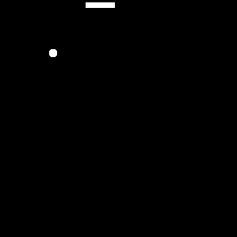

<h1 align="center">@bkrowka</h1>
<!-- 

  <b>Python Developer | AI Enthusiast</b>

 -->

  

  

    
🤖 AI Enthusiast 🤖

      

    
        GIF: "<a href="https://commons.wikimedia.org/wiki/File:Snake_can_be_completed.gif" style="color: #888;">Snake can be completed</a>" by Ustone07, CC BY-SA 3.0. (modified)
    

### PYTHON LIBRARIES & FRAMEWORKS

### DEV TOOLS

